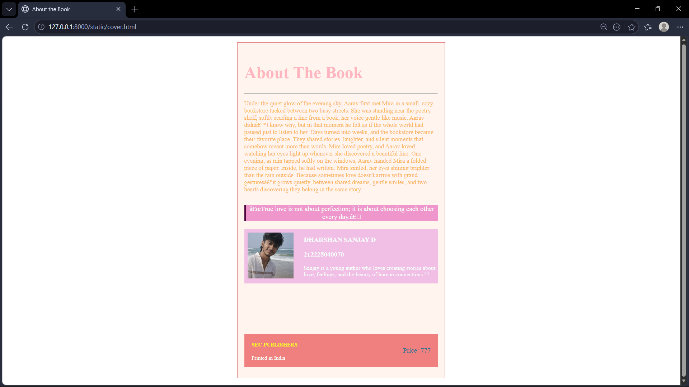

# Ex.05 Book Cover Page Design
## Date:11/3/2026

## AIM:
To design a book back cover page using HTML and CSS.

## DESIGN STEPS:

### Step 1:
Create a Django Admin project.

### Step 2:
Create an app in the Django interface.

### Step 3:
Create a folder named 'static' in the app folder.

### Step 4:
Create a new HTML file in the static folder.

### Step 5:
Write the HTML code with relevant CSS properties.

### Step 6:
Choose the appropriate style and color scheme.

### Step 7:
Insert the images in their appropriate places.

### Step 8:
Publish the website in the LocalHost.

## PROGRAM:
```
<html>
    <head>
        <title>About the Book</title>
        <link href="styles.css" rel="stylesheet">
    </head>
    <body>

        <div class="book">
            <div class="header">
                <h1>About The Book</h1>
                <hr>
            </div>
            <div class="about">
                <p> Under the quiet glow of the evening sky, Aarav first met Mira in a small, cozy bookstore tucked between two busy streets. She was standing near the poetry shelf, softly reading a line from a book, her voice gentle like music. Aarav didn’t know why, but in that moment he felt as if the whole world had paused just to listen to her.
Days turned into weeks, and the bookstore became their favorite place. They shared stories, laughter, and silent moments that somehow meant more than words. Mira loved poetry, and Aarav loved watching her eyes light up whenever she discovered a beautiful line.
One evening, as rain tapped softly on the windows, Aarav handed Mira a folded piece of paper. Inside, he had written:
Mira smiled, her eyes shining brighter than the rain outside.
Because sometimes love doesn't arrive with grand gestures—it grows quietly, between shared dreams, gentle smiles, and two hearts discovering they belong in the same story.</p>
            </div>
            <div class="quotebox">
                <p>
                    “True love is not about perfection; it is about choosing each other every day.”
                </p>
            </div>

            <div class="authorcontent">
            <div class="photo">
            
            </div>

            <div class="author">
            <h3>DHARSHAN SANJAY D</h3>
            <h3>212225040070</h3>
            <p>
                    Sanjay is a young author who loves creating stories about love, feelings, and the beauty of human connections.!!!
            </p>
        </div>
        </div>
        <div class="ending">
            <div class="under">
            <h4>SEC PUBLISHERS</h4>
            <p>Printed in India</p>
            </div>

            <div class="price">Price: 777</div>
         </div>
</body>
</html>


        </div>
        </div>

    </body>
</html>
style.css

body {
    margin: 0;
    padding: 0;
    font-family: Georgia, serif;
    color:rgb(172, 254, 30);
    color: lightpink;
    
}
.book {
    width: 618px;
    height: 1000px;
    margin: 20px auto;
    background-image: url("color.png");
    background-size: cover;
    background-position: center;
    box-sizing: border-box;
    padding: 20px;
    border: 1px solid rgb(229, 125, 125);
    color: mintcream;
    background-color: seashell;
}
.header{
    text-align: left;
    font-size: 25px;
    margin-top: 40px;
    color: lightpink;
    
}
.about {
    font-size: 18px;
    font-weight: light;
    color: light rgb(240, 139, 139);
    margin-top: 10px;
    color: rgb(249, 181, 98);
    
}
.quotebox {
    text-align: center;
    font-family: italic;
    background-color: rgb(239, 151, 204);
    border-left: 5px solid rgb(78, 5, 60);
    font-size: 20px;
    margin-top: 35px;
    margin-bottom: 25px;
}

.photo{
    height: 137px;
    width: 137px;
    display: flex;
    padding: 10px;
}

.authorcontent{
    display: flex;
    background-color: rgb(241, 190, 229);
    
}

.author{
    margin-left: 20px;
    font-size: 17px;
}

.ending{
    background-color: lightcoral;
    margin-top: 150px;
    display: flex;
    justify-content: space-between;
    align-items: center;
    padding: 2px;
}

.ending h4{
    color: rgb(250, 250, 28);
}

.under{
    margin-left: 20px;
}

.price{
    color: rgba(6, 113, 146, 0.86);
    font-size: 20px;
    margin-right: 20px;
}

```

## OUTPUT:


## RESULT:
The program for designing book back cover page using HTML and CSS is completed successfully.
